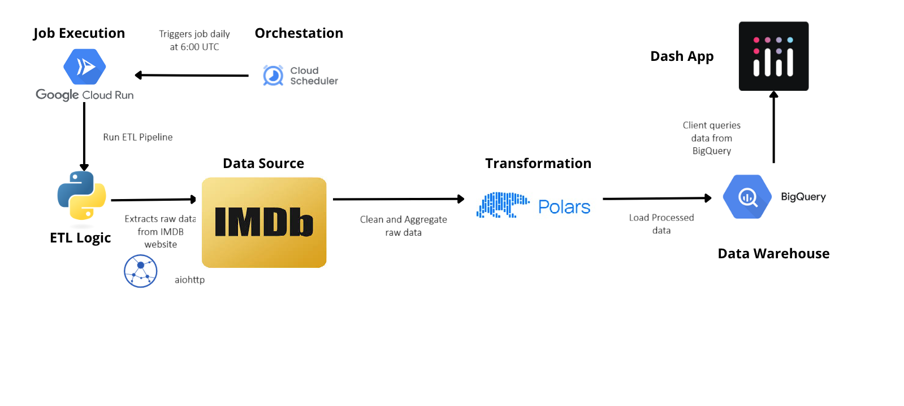

# IMDB Movies ETL

Data pipeline for processing IMDb movie data, transforming it into structured tables, and loading it into BigQuery for analytics.

## Features

- **Extract:** Fetches raw movie and ratings data from IMDb datasets website.
- **Transform:** Cleans, processes, and normalizes raw data for analytical use.
- **Load:** Writes processed data to BigQuery for high-performance querying.
- **Containerized:** Fully Dockerized for easy deployment and scalability.

## Tech Stack

- **Programming Language:** Python 3.12+
- **Data Extraction:** Aiohttp, Asyncio
- **Data Transformation:** Polars
- **Warehouse:** Google BigQuery
- **Containerization:** Docker

## Data Flow



## Prerequisites
- Python 3.12+
- Google Cloud account with BigQuery enabled

## Local Installation

1. **Clone the repository:**
    ```bash
    git clone https://github.com/Alfredomg7/IMDBMoviesETL.git
    cd IMDBMoviesETL
    ```

2. **Create a virtual environment (optional but recommended):**
    ```bash
    python -m venv venv
    source venv/bin/activate  # On Windows: venv\Scripts\activate
    ```

3. **Install dependencies:**
    ```bash
    pip install -r requirements.txt
    ```

4. **Set up environment variables:**
    - Copy `.env.example` to `.env` and fill in your Google Cloud credentials and BigQuery dataset/table IDs.

5. **Run the ETL process:**
    ```bash
    python main.py
    ```
    The ETL job will start, and you can monitor the console output for progress.

## Docker Installation

### Prerequisites
- Docker installed locally

1. **Build the image:**
    ```bash
    docker build -t imdb-analytics-app .
    ```

2. **Run the container:**
    ```bash
    docker run --env-file .env imdb-analytics-app
    ```
    The ETL job will execute automatically inside the container. Check the logs for progress and completion status.

## Google Cloud Deployment

### Prerequisites

- Google Cloud SDK installed and authenticated
- Docker installed locally
- Google Cloud project with billing enabled
- Required APIs enabled:
  - Cloud Run API
  - Cloud Scheduler API
  - Artifact Registry API
  - BigQuery API

### Deploy as Cloud Run Job

1. **Set up environment variables:**
    ```bash
    export PROJECT_ID=your-project-id
    export REGION=us-central1
    export JOB_NAME=imdb-etl-job
    export REPOSITORY=imdb-analytics
    ```

2. **Create Artifact Registry repository (if not exists):**
    ```bash
    gcloud artifacts repositories create $REPOSITORY \
        --repository-format=docker \
        --location=$REGION \
        --description="IMDb ETL Docker images"
    ```

3. **Build and push Docker image to Artifact Registry:**
    ```bash
    gcloud builds submit --tag $REGION-docker.pkg.dev/$PROJECT_ID/$REPOSITORY/$JOB_NAME:latest
    ```

4. **Create Cloud Run Job:**
    ```bash
    gcloud run jobs create $JOB_NAME \
        --image=$REGION-docker.pkg.dev/$PROJECT_ID/$REPOSITORY/$JOB_NAME:latest \
        --region=$REGION \
        --set-env-vars PROJECT_ID=$PROJECT_ID,DATASET_ID=imdb_analytics \
        --set-secrets=PRIVATE_KEY=imdb-private-key:latest,CLIENT_EMAIL=imdb-client-email:latest \
        --max-retries=3 \
        --task-timeout=3600s \
        --memory=2Gi \
        --cpu=2
    ```

    **Note:** Store sensitive credentials in Google Cloud Secret Manager instead of using `.env` file.

5. **Test the job manually:**
    ```bash
    gcloud run jobs execute $JOB_NAME --region=$REGION
    ```

### Schedule with Cloud Scheduler

1. **Create a service account for the scheduler (if not exists):**
    ```bash
    gcloud iam service-accounts create cloud-run-scheduler \
        --display-name="Cloud Run Scheduler Service Account"
    ```

2. **Grant permissions to invoke the job:**
    ```bash
    gcloud run jobs add-iam-policy-binding $JOB_NAME \
        --region=$REGION \
        --member=serviceAccount:cloud-run-scheduler@$PROJECT_ID.iam.gserviceaccount.com \
        --role=roles/run.invoker
    ```

3. **Create a scheduled job (runs daily at 2 AM UTC):**
    ```bash
    gcloud scheduler jobs create http imdb-etl-scheduler \
        --location=$REGION \
        --schedule="0 2 * * *" \
        --uri="https://$REGION-run.googleapis.com/apis/run.googleapis.com/v1/namespaces/$PROJECT_ID/jobs/$JOB_NAME:run" \
        --http-method=POST \
        --oauth-service-account-email=cloud-run-scheduler@$PROJECT_ID.iam.gserviceaccount.com \
        --time-zone="UTC"
    ```

4. **Test the scheduler manually:**
    ```bash
    gcloud scheduler jobs run imdb-etl-scheduler --location=$REGION
    ```

### Update Deployed Job

To update the job with new code changes:

```bash
# Build and push new image
gcloud builds submit --tag $REGION-docker.pkg.dev/$PROJECT_ID/$REPOSITORY/$JOB_NAME:latest

# Update the job
gcloud run jobs update $JOB_NAME \
    --image=$REGION-docker.pkg.dev/$PROJECT_ID/$REPOSITORY/$JOB_NAME:latest \
    --region=$REGION
```

### Monitor Job Executions

- **View job executions:**
    ```bash
    gcloud run jobs executions list --job=$JOB_NAME --region=$REGION
    ```

- **View logs:**
    ```bash
    gcloud logging read "resource.type=cloud_run_job AND resource.labels.job_name=$JOB_NAME" --limit=50
    ```

- **Or use Cloud Console:** Navigate to Cloud Run Jobs → Select your job → View executions and logs

## Data Sources

This project uses the following datasets from [IMDb](https://datasets.imdbws.com/):

- **title.basics:** Core metadata for all titles (movies, TV shows, etc.), including title type, primary/original title, release year, runtime, and genres.
- **title.ratings:** Audience ratings data, containing average user ratings (1.0–10.0) and the total number of votes per title.

## Acknowledgments

- [IMDb Datasets](https://developer.imdb.com/non-commercial-datasets/) for the source data.
- [Google Cloud BigQuery](https://cloud.google.com/bigquery) for robust data warehousing.
- [Polars](https://www.pola.rs/) for fast and efficient data processing.
- [Asyncio](https://docs.python.org/3/library/asyncio.html) and [Aiohttp](https://docs.aiohttp.org/en/stable/) for scalable asynchronous data fetching.

---

For questions, open an issue or contact [alfredomg4000@gmail.com](mailto:alfredomg4000@gmail.com).
